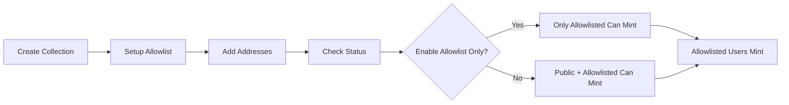

The Collection module enables creation and minting of ERC721 NFT collections with allowlist management (v2.2.1).

## Overview

Use the Collection module to:

- **Create ERC721 collections** - Standard NFT collections
- **Mint NFTs** - Create individual tokens in collections
- **Batch mint** - Efficiently mint multiple NFTs at once
- **Allowlist management** - Configure minting restrictions (v2.2.1)
- **Owner minting** - Mint directly by collection owner

## Allowlist Management (v2.2.1)

::alert{type="info"}
**New Feature:** v2.2.1 introduces comprehensive allowlist management for restricting minting to specific addresses.
::

### Allowlist Features

- **Setup Allowlist** - Configure allowlist with owner mint settings
- **Add to Allowlist** - Add addresses to minting allowlist
- **Remove from Allowlist** - Remove addresses from allowlist
- **Set Allowlist Only** - Enable permanent allowlist-only mode
- **Check Allowlist Status** - Query if address is allowlisted

## API Reference

### Create ERC721 Collection

Deploy a new ERC721 NFT collection contract.

```typescript
const { address, tx } = await sdk.collection.createERC721Collection({
  name: 'My NFTs',
  symbol: 'MNFT',
  baseUri: 'ipfs://QmYourBaseURI/',
  maxSupply: 10000,
});
```

**Parameters:**

| Field | Type | Description |
|-------|------|-------------|
| `name` | `string` | Collection name |
| `symbol` | `string` | Token symbol (e.g., "BAYC") |
| `baseUri` | `string` | Base URI for token metadata |
| `maxSupply` | `number` | Maximum tokens that can be minted |

**Returns:**

```typescript
{
  address: string;  // Deployed contract address
  tx: TransactionResponse;
}
```

### Mint ERC721 NFT

Mint a single NFT in an existing collection.

```typescript
const { tokenId, tx } = await sdk.collection.mintERC721({
  collectionAddress: '0x...',
  recipient: '0x...',
  value: '0.1',  // Optional mint price
});
```

**Parameters:**

| Field | Type | Description |
|-------|------|-------------|
| `collectionAddress` | `string` | Collection contract address |
| `recipient` | `string` | Address to receive the NFT |
| `value` | `string` | Optional ETH payment for mint |

**Returns:**

```typescript
{
  tokenId: string;  // Newly minted token ID
  tx: TransactionResponse;
}
```

### Setup Allowlist (v2.2.1)

Configure allowlist settings for the collection.

```typescript
const { tx } = await sdk.collection.setupAllowlist({
  collectionAddress: '0x...',
  ownerMintLimit: 100,        // Max tokens owner can mint
  allowlistOnly: false,        // Enable allowlist-only mode
});
```

**Parameters:**

| Field | Type | Required | Description |
|-------|------|----------|-------------|
| `collectionAddress` | `string` | Yes | Collection contract address |
| `ownerMintLimit` | `number` | Yes | Maximum tokens owner can mint |
| `allowlistOnly` | `boolean` | Yes | Enable permanent allowlist-only mode |

### Add to Allowlist (v2.2.1)

Add addresses to the minting allowlist.

```typescript
const { tx } = await sdk.collection.addToAllowlist({
  collectionAddress: '0x...',
  addresses: ['0x123...', '0x456...', '0x789...'],
});
```

**Parameters:**

| Field | Type | Required | Description |
|-------|------|----------|-------------|
| `collectionAddress` | `string` | Yes | Collection contract address |
| `addresses` | `string[]` | Yes | Addresses to add to allowlist |

### Remove from Allowlist (v2.2.1)

Remove addresses from the minting allowlist.

```typescript
const { tx } = await sdk.collection.removeFromAllowlist({
  collectionAddress: '0x...',
  addresses: ['0x123...', '0x456...'],
});
```

### Set Allowlist Only (v2.2.1)

Enable or disable permanent allowlist-only mode.

```typescript
const { tx } = await sdk.collection.setAllowlistOnly({
  collectionAddress: '0x...',
  enabled: true,  // true = only allowlisted addresses can mint
});
```

**Parameters:**

| Field | Type | Required | Description |
|-------|------|----------|-------------|
| `collectionAddress` | `string` | Yes | Collection contract address |
| `enabled` | `boolean` | Yes | Enable allowlist-only mode |

### Check Allowlist Status (v2.2.1)

Check if an address is allowlisted for minting.

```typescript
const isAllowlisted = await sdk.collection.isInAllowlist({
  collectionAddress: '0x...',
  address: '0x...',
});
// Returns: boolean
```

### Get Allowlist (v2.2.1)

Get all addresses on the allowlist.

```typescript
const { addresses } = await sdk.collection.getAllowlist({
  collectionAddress: '0x...',
  page: 1,
  limit: 100,
});
```

## React Hooks

Use the `useCollection` hook in React components:

```tsx
import { useCollection } from 'zuno-marketplace-sdk/react';

function CreateCollectionComponent() {
  const {
    createERC721Collection,
    mintERC721,
    setupAllowlist,
    addToAllowlist,
    isInAllowlist
  } = useCollection();

  const handleCreateCollection = async () => {
    const { address, tx } = await createERC721Collection.mutateAsync({
      name: 'My NFT Collection',
      symbol: 'MNC',
      baseUri: 'ipfs://QmYourHash/',
      maxSupply: 10000,
    });

    console.log('Collection deployed at:', address);
    await tx.wait();
  };

  const handleSetupAllowlist = async () => {
    const { tx } = await setupAllowlist.mutateAsync({
      collectionAddress: '0x...',
      ownerMintLimit: 100,
      allowlistOnly: false,
    });

    await tx.wait();
  };

  const handleAddToAllowlist = async () => {
    const { tx } = await addToAllowlist.mutateAsync({
      collectionAddress: '0x...',
      addresses: ['0x...', '0x...'],
    });

    await tx.wait();
  };

  return (
    <div>
      <button onClick={handleCreateCollection}>Create Collection</button>
      <button onClick={handleSetupAllowlist}>Setup Allowlist</button>
      <button onClick={handleAddToAllowlist}>Add to Allowlist</button>
    </div>
  );
}
```

## Complete Example

```typescript
import { ZunoSDK } from 'zuno-marketplace-sdk';

const sdk = new ZunoSDK({
  apiKey: 'your-api-key',
  network: 'sepolia',
});

async function createCollectionWithAllowlist() {
  // Step 1: Create collection
  const { address: collectionAddress, tx: createTx } =
    await sdk.collection.createERC721Collection({
      name: 'Awesome NFTs',
      symbol: 'ANFT',
      baseUri: 'ipfs://QmYourMetadataFolder/',
      maxSupply: 10000,
    });

  console.log('Collection created:', collectionAddress);
  await createTx.wait();

  // Step 2: Setup allowlist (v2.2.1)
  const { tx: setupTx } = await sdk.collection.setupAllowlist({
    collectionAddress,
    ownerMintLimit: 100,
    allowlistOnly: false,  // Don't enable allowlist-only mode yet
  });

  await setupTx.wait();
  console.log('Allowlist configured');

  // Step 3: Add addresses to allowlist
  const { tx: addTx } = await sdk.collection.addToAllowlist({
    collectionAddress,
    addresses: [
      '0xUserAddress1...',
      '0xUserAddress2...',
      '0xUserAddress3...',
    ],
  });

  await addTx.wait();
  console.log('Addresses added to allowlist');

  // Step 4: Check allowlist status
  const isAllowlisted = await sdk.collection.isInAllowlist({
    collectionAddress,
    address: '0xUserAddress1...',
  });

  console.log('Is allowlisted:', isAllowlisted);

  // Step 5: Mint first NFT (owner mint)
  const { tokenId, tx: mintTx } = await sdk.collection.mintERC721({
    collectionAddress,
    recipient: '0xOwnerAddress...',
    value: '0.1',  // Mint price
  });

  console.log('Minted token ID:', tokenId);
  await mintTx.wait();

  return { collectionAddress, tokenId };
}

createCollectionWithAllowlist();
```

## Allowlist Workflow



## Metadata Standards

### ERC721 Token URI Structure

Your `baseUri` should point to a directory containing metadata JSON files:

```
ipfs://QmYourBaseURI/
├── 1.json
├── 2.json
├── 3.json
└── ...
```

Each metadata file should follow the OpenSea standard:

```json
{
  "name": "NFT #1",
  "description": "A unique digital collectible",
  "image": "ipfs://QmImageHash/1.png",
  "attributes": [
    {
      "trait_type": "Background",
      "value": "Blue"
    },
    {
      "trait_type": "Rarity",
      "value": "Legendary"
    }
  ]
}
```

## Error Handling

```typescript
try {
  const { address } = await sdk.collection.createERC721Collection({
    name: 'My Collection',
    symbol: 'MC',
    baseUri: 'ipfs://...',
    maxSupply: 10000,
  });
} catch (error) {
  if (error.code === 'INSUFFICIENT_FUNDS') {
    console.error('Not enough ETH for deployment gas');
  } else if (error.message.includes('Symbol already exists')) {
    console.error('Collection symbol must be unique');
  } else {
    console.error('Deployment failed:', error);
  }
}
```

## Best Practices

::alert{type="success"}
**Use IPFS for metadata** - Store your metadata on IPFS for decentralization:

```typescript
const baseUri = 'ipfs://QmYourPinnedFolder/';
```
::

::alert{type="info"}
**Set reasonable owner mint limit** - Control owner minting with allowlist:

```typescript
// Good: reasonable limit
ownerMintLimit: 100

// Avoid: too high
ownerMintLimit: 10000
```
::

::alert{type="warning"}
**Test allowlist before enabling allowlist-only mode** - Always test on testnet first:

```typescript
// First, setup without allowlist-only mode
await sdk.collection.setupAllowlist({
  collectionAddress,
  ownerMintLimit: 100,
  allowlistOnly: false,  // Test with this set to false
});

// Add addresses and test minting
await sdk.collection.addToAllowlist({
  collectionAddress,
  addresses: testAddresses,
});

// Only after testing, enable allowlist-only mode
await sdk.collection.setAllowlistOnly({
  collectionAddress,
  enabled: true,
});
```
::

## See Also

- **[Exchange Module](/core-modules/exchange)** - List and sell your NFTs
- **[Auction Module](/core-modules/auction)** - Auction your NFTs
